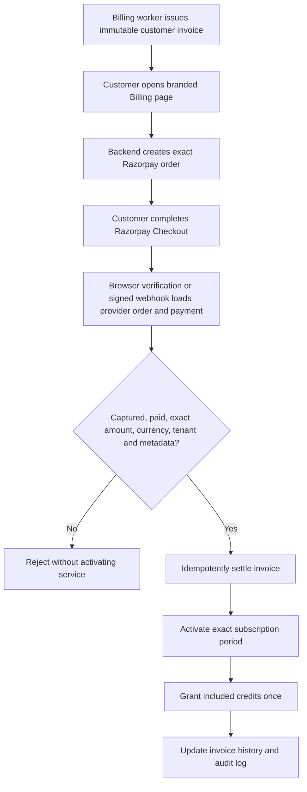
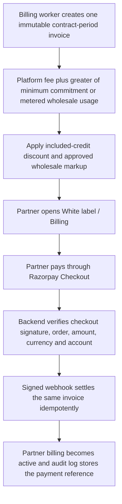
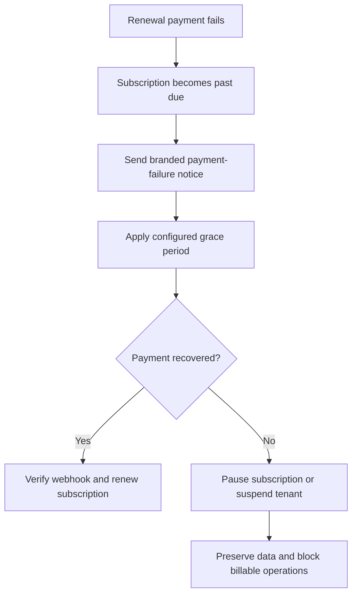

# White-Label Operations Guide

This document explains only the white-label system. It covers the platform super-admin console, the partner console, every visible field, lifecycle rules, launch requirements, customer provisioning, verified retail billing, and production operations.

## 1. Roles and website locations

| Role | Website | Responsibility |
|---|---|---|
| Platform super administrator | `/platform-admin/white-label` | Approves partners, sets wholesale contract terms and hard limits, controls partner lifecycle and billing status, and reviews platform audit logs. |
| White-label partner owner/admin | `/dashboard/white-label` | Configures the customer-facing brand, verifies domains and email, creates retail plans, provisions customer tenants, and manages customer status. |
| White-label customer | Partner's verified app domain | Uses the branded voice platform under the plan assigned by the partner. |

Platform administration requires the `super_admin` role. In production, the user must also have a verified email address and two-factor authentication enabled.

The partner's organization is the owner of the white-label account. A partner owner organization cannot also be a customer of another white-label account.

## 2. End-to-end launch workflow

Use this order for a new white-label partner:

1. The platform super admin approves an eligible owner organization.
2. The system creates a white-label account in `onboarding` status and a draft default brand.
3. The partner opens `/dashboard/white-label`.
4. The partner completes brand, support, legal, and email settings.
5. The partner saves the sender email address and verifies its Resend domain.
6. The partner publishes the default brand.
7. The partner reserves an app hostname, adds the displayed DNS records, and verifies the domain.
8. The partner creates and publishes at least one customer plan.
9. The super admin configures verified customer checkout, tax snapshot, settlement mode, and grace policy when the platform will collect retail invoices.
10. The super admin sets billing to `trialing` or `active` and lifecycle to `active`.
11. The partner provisions customer organizations.

The launch page shows four gates. All four should pass:

- Brand published.
- Custom domain active.
- Customer plan published.
- Platform contract active with billing `trialing` or `active`.

## 3. Platform super-admin console

### 3.1 Eligible owner organization

The organization selected here becomes the white-label partner owner.

An organization appears only when it:

- Is active or is a compatible legacy organization.
- Is not already a white-label customer.
- Does not already own another white-label account.

After approval, the organization disappears from the eligible list because one organization can own only one white-label account.

### 3.2 Partner approval fields

| Field | Meaning | Guidance |
|---|---|---|
| Eligible owner organization | Existing organization that will own the partner business. | Select the partner's real operating organization. |
| Partner account name | Internal and partner-facing account name. | Use the partner company or product name. |
| Account slug | Stable lowercase identifier for the account. | Leave blank to generate it from the account name. Avoid changing its business meaning later. |
| Contract currency | Currency used for the platform-to-partner contract. | Currently `USD` or `INR`. |
| Platform fee / month | Fixed monthly platform fee charged to the partner. | The website accepts major units. `499` means $499 for USD or ₹499 for INR. |
| Minimum commitment | Minimum contractual monthly amount. | Use `0` when no minimum commitment applies. |
| Wholesale markup % | Wholesale percentage recorded in the partner contract. | `10` means 10%. |
| Customer tenants | Maximum customer organizations the partner may provision. | This is an account-wide hard ceiling. |
| Agents/customer | Maximum agents any partner customer plan may allow. | Customer plans cannot exceed it. |
| Members/customer | Maximum organization members any customer plan may allow. | Includes tenant team membership capacity. |
| Numbers/customer | Maximum phone numbers any customer plan may allow. | Use `0` when telephony numbers are not included. |
| Concurrent calls | Maximum simultaneous calls any customer plan may allow. | Runtime call admission is enforced atomically. |
| Monthly minutes | Maximum monthly-minute ceiling any customer plan may allow. | A plan cannot publish a higher value. |
| Initial product name | Initial customer-facing branded product name. | The partner can complete it later in the Brand tab. |
| Legal company name | Legal entity displayed in branded content. | Use the registered business name. |
| Support email | Customer-facing support address. | Use an address controlled by the partner. |

Approving the form creates:

- One white-label account in `onboarding`.
- One draft default brand.
- Contract and limit records.
- A platform audit entry.

### 3.3 Initial entitlements

The current approval form assigns these defaults:

| Entitlement | Default |
|---|---:|
| Custom app/link domains | Enabled |
| Custom API domains | Disabled |
| Custom email branding | Enabled |
| Remove “Powered by” | Enabled |
| Custom customer pricing | Enabled |
| Multiple brands | Disabled |
| Bring your own AI providers | Disabled |
| Advanced analytics | Enabled |
| Developer API | Enabled |

The super-admin commercial panel exposes and audit-logs every entitlement switch. Disabling an entitlement blocks the corresponding server-side operation even if a client attempts it directly.

### 3.4 Lifecycle and billing state

Lifecycle and billing are separate controls.

#### Lifecycle values

| Value | Effect |
|---|---|
| `draft` | Internal pre-onboarding state. New approvals currently start at `onboarding`. |
| `onboarding` | Partner may complete setup, but the branded service is not fully launched. |
| `active` | Partner account is operational. |
| `suspended` | Partner service is temporarily disabled and may later be reactivated. |
| `terminated` | Partner relationship is permanently ended. Normal transitions cannot restore it. |

Allowed lifecycle transitions:

- `draft` → `onboarding` or `terminated`
- `onboarding` → `active`, `suspended`, or `terminated`
- `active` → `suspended` or `terminated`
- `suspended` → `active` or `terminated`
- `terminated` → no further state

Activating an account requires:

- Billing status `trialing` or `active`.
- A published default brand.

#### Billing values

| Value | Meaning |
|---|---|
| `not_configured` | Commercial billing has not been enabled. |
| `trialing` | Partner is operating under an approved trial. |
| `active` | Partner billing is in good standing. |
| `past_due` | Payment requires attention. |
| `suspended` | Billing access is stopped. |
| `cancelled` | Billing relationship has ended. |

Only `trialing` or `active` allows activation and normal branded customer authentication.

#### Required audit reason

This is a human-readable explanation, not a password or reference code. It must be 8–2,000 characters.

Examples:

```text
Initial partner activation after completing launch checks
```

```text
Partner suspended after invoice remained unpaid
```

If lifecycle and billing already show the intended values, do not submit another same-state update without a real operational reason.

### 3.5 Commercial controls

| Field | Meaning |
|---|---|
| Platform fee | Monthly fee in major currency units. |
| Minimum | Minimum monthly commitment in major currency units. |
| Wholesale % | Platform-to-partner wholesale markup percentage. |
| Tenant limit | Maximum number of customer organizations. |
| Agents/customer | Hard agent ceiling for each customer. |
| Concurrency | Hard simultaneous-call ceiling for each customer. |
| Verified retail checkout | Enables server-issued customer invoices and Razorpay Checkout. Manual partner activation is blocked for these subscriptions. |
| Razorpay linked account | Optional `acc_...` Route destination owned by the partner. |
| Settlement mode | Platform settlement, or full-amount Route transfer. Route full-amount settlement is restricted to INR plans. |
| Customer payment grace | Days between a due/failed payment and automatic subscription pause. |
| Retail tax rate and label | Rate and display label frozen into each customer invoice. Tax behavior is frozen by the plan version. |
| Tax registration ID | Partner tax identifier printed on the customer invoice. |
| Account entitlements | Server-enforced custom-domain, API, analytics, provider, branding, and developer capabilities. |
| STT models | Maximum speech-to-text catalog the partner may include in customer plans. |
| LLM and realtime models | Maximum language-model catalog. Native realtime voice models are controlled in this group. |
| TTS models | Maximum text-to-speech catalog the partner may include in customer plans. |
| Required audit reason | Explanation for the commercial change; minimum 8 characters. |

Example reason:

```text
Approved annual contract pricing and revised capacity limits
```

The commercial update form preserves member, phone-number, and monthly-minute limits that are not shown in that smaller update panel.

Contract amounts are stored, displayed, audit-tracked, and collected through a dedicated white-label partner invoice flow. This flow is separate from the existing direct-platform customer billing routes.

#### Model-access control flow

1. The platform super admin opens the partner account.
2. Under **Commercial and model controls**, the super admin selects the maximum allowed STT, LLM/realtime, and TTS models.
3. The partner's plan editor displays only those allowed models.
4. The partner selects a smaller subset for each customer plan.
5. Publishing freezes the model selection with the plan version.
6. Customer provisioning copies that selection into the immutable subscription snapshot.
7. The customer agent builder hides unavailable models, while backend validation rejects direct API attempts to use them.

Reducing a partner's account catalog does not silently rewrite existing customer subscriptions. It prevents new or revised plans from exceeding the new ceiling. Existing published plans outside the new ceiling must be revised before they can be assigned to new customers.

### 3.6 Partner account detail

The detail summary displays:

- **Customers:** provisioned customer organizations.
- **Brands:** brand records owned by the partner.
- **Domains:** custom hostname records.
- **Plan versions:** all draft, published, and archived plan versions.
- **Economics snapshot:** platform terms and the partner's published retail catalog.
- **Audit trail:** who changed a privileged setting, when it changed, the reason, and the affected resource.

## 4. Partner white-label console

The partner console is available to organization owners and admins after the platform super admin approves the organization.

### 4.1 Launch control

The launch screen summarizes:

| Metric | Meaning |
|---|---|
| Customers | Current customer tenants compared with contract capacity. |
| Active subscriptions | Trialing, active, past-due, or paused customer subscriptions. |
| Active domains | Successfully verified domains compared with all domain records. |
| Published plans | Saleable immutable plan versions compared with all versions. |
| Projected monthly recurring | Sum of recurring prices from current subscriptions. |
| Customer usage charges | Usage charged to customers under their plan snapshots. |
| Wholesale usage cost | Underlying provider and platform usage cost. |
| Usage contribution | Customer usage charges minus wholesale usage cost. A negative value means the partner absorbed cost. |

### 4.2 Brand fields

| Field | Meaning | Validation |
|---|---|---|
| Product name | Name customers see in navigation, authentication, metadata, email, and dashboard text. | 2–80 characters. |
| Legal/company display name | Company name used in branded presentation. | 2–120 characters. |
| Logo URL | Primary externally hosted logo. | Public HTTPS image URL. |
| Dark logo URL | Alternate logo for dark surfaces. | Optional public HTTPS image URL. |
| Square icon URL | Favicon/PWA-style square brand icon. | Public HTTPS image URL. |
| Primary color | Main action and highlight color. | Six-digit hexadecimal color. |
| Secondary color | Supporting brand color. | Six-digit hexadecimal color. |
| Accent color | Secondary highlight color. | Six-digit hexadecimal color. |
| Surface color | Main branded background/surface color. | Six-digit hexadecimal color. |
| Support email | Address customers use for support. | Valid email address. |
| Website URL | Partner's public website. | HTTPS URL. |
| Help center URL | Partner documentation/support portal. | HTTPS URL. |
| Terms URL | Partner terms of service. | Required HTTPS URL before publication. |
| Privacy URL | Partner privacy policy. | Required HTTPS URL before publication. |
| Legal business name | Registered entity shown in legal content. | Required before publication. |
| Email sender name | Display name shown in transactional email clients. | Up to 120 characters. |
| Verified sender address | Actual branded From address, such as `no-reply@brand.com`. | Must be saved and its domain verified in Resend. |
| Email reply-to | Address that receives customer replies. | Valid email address. |

Supported external image-path extensions are `.avif`, `.gif`, `.ico`, `.jpeg`, `.jpg`, `.png`, `.svg`, and `.webp`. Localhost, private/local hostnames, plain HTTP, and IP-address asset URLs are rejected.

Partners can also upload raster logo, dark-logo, and icon files directly from the Brand panel when Cloudflare Images is configured. Uploads are held in memory, limited to 10 MB, MIME-filtered, stored through the Cloudflare Images API, validated again as public HTTPS assets, and audit-logged. External HTTPS URLs remain supported.

#### Email-domain workflow

1. Add the sending domain to the configured Resend account.
2. Add Resend's required DNS records at the DNS provider.
3. Enter the branded sender address in the Brand form.
4. Save the brand.
5. Click **Verify email domain**.
6. Wait for status `verified`.

Changing the sender address resets verification. A brand cannot be newly published without a configured, verified sender domain. Branded email delivery fails closed instead of falling back to the platform sender.

#### Publish-brand requirements

The default brand requires:

- Logo URL.
- Square icon URL.
- Support email.
- Terms URL.
- Privacy URL.
- Legal business name.
- Sender email address.
- Verified sending domain.

Published branding drives customer metadata, authentication, dashboard labels, legal/support links, transactional emails, dynamic application manifest, and developer API examples.

### 4.3 Domain fields and statuses

#### Add-domain fields

| Field | Meaning |
|---|---|
| Brand | Brand served by the hostname. |
| Domain type | `app` for the dashboard, `api` for developer/API traffic, or `link` for public links. API domains require the custom-API-domain entitlement. |
| Hostname only | Domain without scheme, path, port, or credentials. Example: `app.brand.com`. |

Do not enter `https://`, a trailing path, or a port.

The partner website creates app, API, and public-link domains. A partner can explicitly disable a domain with an audit reason; disabled domains fail closed and are excluded from automated verification.

#### Required DNS record columns

| Column | Meaning |
|---|---|
| Type | `TXT` or `CNAME`. |
| DNS name | Host/name to create at the DNS provider. |
| Value | Exact value or target supplied by the platform. |
| Purpose | Ownership, routing, or certificate validation. |

#### Domain statuses

| Status | Meaning |
|---|---|
| `pending` | Domain record was reserved. |
| `verifying` | Verification is currently running. |
| `awaiting_dns` | Ownership or routing DNS is missing or has not propagated. |
| `awaiting_certificate` | Routing is ready but TLS certificate issuance is pending. |
| `active` | Ownership, routing, edge, and TLS checks passed. |
| `failed` | Verification failed; inspect the failure reason. |
| `disabled` | Domain is intentionally disabled. |

TLS statuses progress from `not_started` through validation/issuance to `active`.

After adding the displayed records, wait for DNS propagation and click **Verify now**. Automated background verification also retries due domain records.

### 4.4 Customer pricing-plan fields

Published plan versions are immutable. Editing commercial terms requires a new revision, and existing customers keep the exact snapshot assigned when their subscription was created.

| Field | Meaning |
|---|---|
| Plan name | Customer-facing plan name, such as Growth. |
| Stable key | Long-lived machine identifier, such as `growth`. All versions share the same key. |
| Currency | Retail-plan currency, currently USD or INR. |
| Monthly price | Recurring monthly retail price in major currency units. |
| Setup fee | One-time onboarding/setup price in major units. It is recorded in the plan snapshot. |
| Trial days | Number of trial days, from 0 to 365. |
| Usage charging | Selects the usage-pricing formula. |
| Usage markup % | Used by provider-cost-plus-markup mode. `40` means 40%. |
| Price per minute | Used by fixed-per-minute mode. Enter a major currency amount. |
| Included minutes | Minutes included before billable overage logic. |
| Agent limit | Maximum agents for customers on this plan. |
| Member limit | Maximum organization members for customers on this plan. |
| Monthly-minute ceiling | Absolute monthly-minute ceiling for customers on the plan. |
| STT models | Speech-to-text models included in this plan. |
| LLM and realtime models | Pipeline LLMs and native realtime models included in this plan. |
| TTS models | Text-to-speech models included in this plan. |

The plan must contain at least one usable stack: either one allowed realtime model, or a complete combination containing one STT, one pipeline LLM, and one TTS model. A plan cannot include a model that the platform super admin excluded from the partner contract.

#### Usage charging modes

| Mode | Calculation |
|---|---|
| Provider cost + markup | Customer usage price is calculated from wholesale provider/platform cost plus the plan markup. |
| Fixed per minute | Billable seconds are prorated against the configured per-minute amount. |
| Included minutes only | Calls use included allowance. The current plan form disables overage for this mode. |

The current website also saves these defaults even though they are not visible in the shortened plan form:

- Phone-number limit: 5.
- Concurrent calls: 5.
- Knowledge sources: 50.
- API keys: 5.
- Campaigns, inbound calls, outbound calls, recording, knowledge base, integrations, analytics, and team access: enabled.
- Customer developer API: disabled.

Every plan limit must stay within the hard ceilings approved by the platform super admin.

#### Recommended introductory Growth plan

The plan form starts with these lower-risk commercial defaults:

| Field | Default |
|---|---:|
| Monthly price | USD 99 |
| Setup fee | USD 0 |
| Trial | 7 days |
| Included AI-call minutes | 100 per billing period |
| Overage | Provider cost + 40% |
| Monthly-minute ceiling | 1,000 |

For example, if a customer uses 150 minutes and the underlying provider cost is USD 0.10 per minute, the first 100 minutes are included. The remaining 50 minutes cost USD 7.00 after the 40% markup (`50 × USD 0.14`). The bill is USD 106 plus any applicable tax and separately calculated human-transfer usage.

The trial currently uses the same 100-minute allowance as the paid period. A separate 20-minute trial cap is not represented by the current plan schema, so do not advertise a 20-minute trial limit unless that enforcement is implemented.

#### Plan actions

- **Create draft version:** creates an editable, non-saleable version.
- **Edit draft:** loads an existing draft so its price, limits, and model subset can be changed before publication.
- **Publish immutable version:** makes the version available for new customer subscriptions and prevents editing.
- **Create revision:** clones a published version into a new draft version.
- **Archive:** removes the published version from new sales; existing subscriptions retain their snapshot.

### 4.5 Customer provisioning fields

| Field | Meaning |
|---|---|
| Organization | New isolated customer workspace name. |
| Owner name | Name of the customer's initial owner. |
| Owner email | Login and branded activation-email recipient. |
| External customer ID | Optional ID from CRM, ERP, contract, or billing system. It must be unique within the partner account when supplied. |
| Published brand | Brand/domain identity assigned to the customer. |
| Published plan | Immutable plan version snapshotted into the customer's subscription. |

Provisioning creates:

- Isolated customer organization.
- Owner membership.
- White-label subscription with immutable price, allowance, limit, and feature snapshots.
- Immutable STT, LLM/realtime, and TTS access snapshot.
- Customer credit wallet.
- Initial server-issued retail invoice when verified retail checkout is enabled. A no-trial subscription starts `incomplete` and cannot use billable features until that invoice is verified as paid.
- Branded activation or login email.

The customer table displays:

- Customer name and external ID/slug.
- Owner name and email.
- Assigned brand.
- Plan key and version.
- Current subscription-period end.
- Tenant lifecycle status.
- Subscription status.

#### Customer actions

- **Suspend:** temporarily blocks the customer tenant. A reason is required.
- **Reactivate:** restores an eligible suspended tenant. A reason is required.
- **Renew:** available for legacy partner-managed billing. It changes an eligible non-active subscription to active and advances it using the stored plan snapshot. Verified retail subscriptions cannot be manually activated; they renew only from a verified captured payment or a zero-value invoice.

### 4.6 Customer subscription statuses

| Status | Meaning |
|---|---|
| `incomplete` | Initial retail invoice has not been paid. Billing remains available, but billable product operations are blocked. |
| `trialing` | Customer is within a plan trial period. |
| `active` | Customer subscription is in good standing. |
| `past_due` | Renewal/payment is overdue. |
| `paused` | Subscription use is temporarily paused. |
| `cancelled` | Subscription has been cancelled. |
| `expired` | Subscription period ended without a valid renewal. |

Customer call concurrency is enforced using atomic subscription slots. Member admission is also transactionally checked against the subscription snapshot.

### 4.7 Contract tab

The partner can view but cannot edit platform wholesale terms:

| Field | Meaning |
|---|---|
| Platform fee | Fixed partner contract fee. |
| Minimum commitment | Contractual minimum amount. |
| Included credits | Credits included in the platform contract. |
| Wholesale markup | Platform-level wholesale markup. |
| Payment terms | Number of days allowed for partner payment. |
| Credit limit | Approved partner credit exposure. |
| Hard tenant ceilings | Maximum tenants and per-customer resources allowed by the contract. |

Only a platform super admin can update these values.

## 5. Billing and payment boundary

White-label customer billing has two explicit modes:

- `white_label_customer_checkout`: server-issued retail invoices collected and verified through Razorpay.
- `white_label_partner_managed`: legacy/off-platform collection where an authorized partner operator records renewal manually.

### 5.1 Verified customer checkout flow



The browser never supplies the invoice amount, currency, tenant, plan, or service period. Those values come from the immutable subscription snapshot. Checkout verification checks the HMAC response and then retrieves the Razorpay order and payment server-to-server. The same settlement routine handles `order.paid` and `payment.captured` webhooks, so browser and webhook races are safe.

Durable uniqueness protects the invoice period, Razorpay order ID, payment ID, transfer ID, and webhook payload digest. A retry after partial processing re-runs subscription activation and the included-credit idempotency key instead of returning early.

This is invoice-based renewal, not a stored-card mandate: the system automatically issues and duns renewal invoices, while the customer authorizes each payment in Checkout.

### 5.2 Tax and settlement

The platform super admin configures the partner's tax rate, tax label, registration ID, settlement mode, and grace period. Each plan version declares tax behavior. The current partner plan form creates explicit exclusive-tax plan snapshots.

- Exclusive tax is added to recurring price plus the initial setup fee.
- Inclusive tax is extracted from the quoted total without increasing it.
- A positive configured tax rate is rejected when any published or assigned plan has unspecified tax behavior.
- Invoice amount, rate, label, registration ID, and tax behavior are frozen and never recomputed after issuance.

Tax configuration performs deterministic invoice arithmetic; it does not determine customer jurisdiction, register the merchant, file returns, or remit taxes. The partner remains responsible for legally correct rates and registrations.

Settlement defaults to the platform Razorpay account. Optional full-amount Razorpay Route settlement binds an `acc_...` linked account to the white-label account and embeds the transfer in the order. This mode is limited to INR plans and is rejected when a published or assigned non-INR plan exists. Transfer webhooks update the durable transfer status without changing whether the customer payment itself was captured.

### 5.3 Partner-to-platform payment flow

Customer retail payments and the partner's platform contract are separate money flows.



The application now generates partner contract invoices automatically, exposes a dedicated partner **Billing** tab, and collects them through Razorpay. A successful browser verification or signed webhook can settle the invoice; processing is idempotent, so both arriving does not double-credit or double-record payment.

The partner invoice calculation is:

```text
billable wholesale usage = wholesale usage - included-credit discount
metered usage = billable wholesale usage + wholesale markup
committed usage = greater of minimum commitment or metered usage
partner invoice total = platform fee + committed usage
```

The invoice freezes the contract-period amount and usage cutoff. Usage recorded after that cutoff is picked up by the next contract-period invoice. Zero-value invoices settle internally without opening Razorpay.

When an open invoice passes its due date, the lifecycle worker changes it to `past_due`. The account becomes `past_due`, or `suspended` when **Auto suspend on past due** is enabled. A later verified payment returns partner billing to `active` unless the commercial account was cancelled.

This partner-to-platform payment remains separate from customer retail invoices and from ordinary platform-organization wallet/subscription billing.

### 5.4 Failed customer payment flow



The lifecycle worker creates renewal invoices at period end. A due or failed payment moves the subscription to `past_due`, sends a branded notice, and starts the configured grace period. Payment during grace restores `active` service for the exact invoice period. When grace expires, the worker changes the subscription to `paused`, sends a branded pause notice, preserves customer data, and blocks billable operations. A later verified payment performs the same recovery path idempotently.

A processed partial refund is recorded against the immutable invoice without automatically changing service. A full refund pauses the current subscription and issues a linked replacement invoice that does not grant the period allowance a second time. A new payment cannot resettle a refunded or disputed invoice. A payment dispute pauses the current subscription while it is open; a merchant win restores the paid invoice and eligible subscription, while a loss treats the payment as fully reversed and issues the same controlled replacement path. Every transition is audit-logged and customer-notified.

For verified retail billing, a partner cannot manually mark the subscription active. Legacy partner-managed accounts retain the audited manual renewal action for off-platform collection.

### 5.5 Required Razorpay webhooks

Configure the production webhook URL as `/api/webhooks/razorpay` with the same secret stored in `RAZORPAY_WEBHOOK_SECRET`. Subscribe at minimum to:

- `order.paid`
- `payment.captured`
- `payment.failed`
- `refund.processed`
- `payment.dispute.created`, `payment.dispute.under_review`, `payment.dispute.action_required`, `payment.dispute.won`, `payment.dispute.lost`, and `payment.dispute.closed`
- `transfer.processed`, `transfer.failed`, and `transfer.reversed` when Route settlement is enabled
- Existing platform subscription and invoice events when ordinary Enterprise Autopay is also used

Webhook bodies are signature-verified from raw bytes before parsing. Failed processing is recorded and may be retried; already processed payloads return idempotently.

## 6. Recommended test configuration

Use conservative values while validating the workflow:

| Field | Suggested test value |
|---|---:|
| Platform fee | 0 |
| Minimum commitment | 0 |
| Wholesale markup | 0% |
| Customer tenants | 10 |
| Agents/customer | 5 |
| Members/customer | 5 |
| Numbers/customer | 2 |
| Concurrent calls | 2 |
| Monthly minutes/customer | 500 |

Example audit reason:

```text
Initial test configuration for white-label onboarding
```

Before production, replace these with signed commercial limits and prices.

## 7. Production configuration requirements

The backend requires these white-label environment values in production:

```env
WHITE_LABEL_ENABLED=true
WHITE_LABEL_CNAME_TARGET=your-edge-cname-target
CLOUDFLARE_API_TOKEN=your-token
CLOUDFLARE_ZONE_ID=your-zone-id
# Optional unless managed brand uploads are required
CLOUDFLARE_ACCOUNT_ID=your-account-id
PLATFORM_ADMIN_EMAILS=admin@example.com
RESEND_API_KEY=your-resend-key
EMAIL_FROM=Platform Name <no-reply@platform-domain.com>
RAZORPAY_KEY_ID=rzp_live_...
RAZORPAY_KEY_SECRET=your-live-secret
RAZORPAY_WEBHOOK_SECRET=your-webhook-secret
```

The frontend has a separate build-time rollout switch:

```env
NEXT_PUBLIC_WHITE_LABEL_ENABLED=true
```

Keep both backend `WHITE_LABEL_ENABLED` and frontend `NEXT_PUBLIC_WHITE_LABEL_ENABLED` disabled for the initial production deployment and direct-platform regression test. Enable the backend first, then rebuild the frontend with its switch enabled only after the backend prerequisites pass validation. With either switch disabled, white-label management stays unavailable and configured platform hosts continue using the normal Vozon experience.

Also configure the normal frontend/backend URLs and allowed origins. Never commit real secrets to source control.

Cloudflare credentials must permit the custom-hostname operations used by the domain provisioning service. Managed uploads additionally require the Cloudflare account ID and Images write permission. Resend must contain each partner sending domain before the partner can verify and publish that branded sender.

Production disables automatic Mongoose index creation. After building and before shifting traffic, run:

```text
npm run setup:dashboard-indexes
```

This creates the declared white-label account, domain, subscription, partner-invoice, customer-invoice, provider-identity, audit, and supporting indexes without dropping unrelated indexes. Confirm `/health` reports database, Razorpay, white-label domain, email, and—when used—asset-upload readiness.

## 8. Security rules

- Super-admin routes require authenticated `super_admin` access.
- Production super-admin access also requires verified email and 2FA.
- Partner operations require owner or admin membership in the owner organization.
- Customer organizations are bound to the exact white-label account and brand domain.
- Branded domains remain fail-closed until validation succeeds.
- Branded email requires a verified sender and does not fall back to the platform identity.
- Published plan versions are immutable.
- Customer invoice values come only from immutable server snapshots; the browser cannot choose the amount or tenant.
- Retail activation requires exact captured provider payment verification or a zero-value internal invoice.
- Provider identities and per-period allowance grants are idempotent.
- Privileged platform changes require and store an audit reason.
- API and resource entitlements are enforced server-side, not only hidden in the interface.

## 9. Common troubleshooting

### No organizations appear in the approval list

Confirm that the organization:

- Is not suspended or archived.
- Is not already a white-label customer.
- Does not already own a white-label account.

### Partner cannot access `/dashboard/white-label`

Confirm that:

- A super admin approved the user's current organization.
- The user is an owner or admin of that organization.
- The user selected the correct organization in the platform dashboard.

### Account cannot be activated

Confirm that:

- Billing is `trialing` or `active`.
- The default brand is published.
- The audit reason contains at least eight characters.

### Brand cannot be published

Complete all required brand, legal, support, logo/icon, and verified sender fields. Save sender changes before clicking domain verification.

### Domain does not become active

Copy every displayed DNS record exactly, remove conflicting records, allow time for propagation, and run **Verify now**. Review the failure reason and TLS status.

### Customer cannot be provisioned

Confirm that:

- The partner has not reached its customer-tenant ceiling.
- A brand is published.
- A plan version is published.
- The selected plan is within the platform contract limits.
- Every selected STT, LLM/realtime, and TTS model remains within the super-admin catalog ceiling.
- The owner email and optional external customer ID are valid and available.

### Customer cannot start calls

Confirm that:

- Tenant lifecycle is active.
- Subscription is trialing or active.
- Monthly-minute allowance remains available.
- Concurrent-call capacity remains available.
- The selected call feature is included in the plan snapshot.
- The agent's realtime model or complete STT/LLM/TTS stack is included in the subscription snapshot.

### Customer checkout is unavailable or payment does not activate service

Confirm that:

- Verified retail checkout is enabled for the white-label account.
- `RAZORPAY_KEY_ID`, `RAZORPAY_KEY_SECRET`, and `RAZORPAY_WEBHOOK_SECRET` are live production values from the same Razorpay account.
- The webhook URL is reachable and subscribed to the required events.
- The invoice is `open` or `past_due`, and its order, captured payment, amount, currency, and tenant metadata match.
- A configured tax rate has an explicit inclusive or exclusive plan snapshot.
- Route full-amount settlement is used only with INR and the configured linked account.

The invoice remains unpaid when any verification value differs. Inspect the Razorpay webhook event record and backend error log before retrying; do not activate the subscription manually.

### Model is missing or rejected

Confirm that the model is configured at platform level, allowed by the super admin for the white-label account, selected in the published customer plan, and present in the customer's subscription snapshot. Realtime models appear under the LLM group. Published subscriptions are immutable, so changing access for an existing customer requires a controlled plan/subscription migration rather than editing its historical snapshot.

## 10. Recommended operating discipline

- Use the clean legal partner organization as the owner organization.
- Start every partner in onboarding.
- Verify brand, email, domain, and pricing before activation.
- Use meaningful audit reasons containing invoice, contract, or ticket references when available.
- Publish new plan revisions instead of changing active customer economics in place.
- Keep legacy manual renewals tied to an external payment or approved trial record. Use verified retail checkout for in-platform collection.
- Test login, password reset, invitation email, managed asset upload, app/API/link domain TLS, initial checkout, webhook-only settlement, duplicate webhook delivery, failed payment, grace recovery, grace expiry, Route transfer status when enabled, one inbound call, one outbound call, call recording, and a limit rejection before production launch.

## 11. Production release checklist

- [ ] An existing direct-platform organization passes registration, login, billing, agent, call, and organization-switching smoke tests on every reserved `PLATFORM_HOSTS` hostname.
- [ ] Backend and frontend use the same `PLATFORM_HOSTS`; API-capable platform origins also appear in backend `ALLOWED_ORIGINS`.
- [ ] Production secrets pass backend startup validation; no test Razorpay key is present.
- [ ] Backend `npm run build` and `npm test` pass in CI.
- [ ] Frontend `npm run lint` has no errors and `npm run build` passes.
- [ ] `npm run setup:dashboard-indexes` completes against the production database before traffic is shifted.
- [ ] `/health` reports the database, Razorpay, email, custom-domain edge, and required asset-upload checks as configured.
- [ ] Razorpay webhook signature verification succeeds from the production webhook dashboard and duplicate delivery is harmless.
- [ ] Cloudflare custom-hostname token is zone-scoped; the optional Images token has only the required account permission.
- [ ] Every published brand has verified TLS, legal/support content, and a verified Resend sender.
- [ ] Each retail-billed plan has the correct currency, explicit tax behavior, signed tax rate, registration ID, grace policy, and settlement choice.
- [ ] A low-value live invoice is tested end to end, including invoice download, browser verification, webhook settlement, allowance grant, partial/full refund, dispute pause/recovery, replacement payment, and audit records.
- [ ] When Route is enabled, the linked account and transfer webhook status are reconciled against the Razorpay dashboard.
- [ ] Database backups, error monitoring, webhook-failure alerts, billing-worker alerts, and an incident owner are configured.
- [ ] The partner's finance/legal owner approves tax jurisdiction, invoicing language, refund/chargeback policy, and settlement responsibility.
